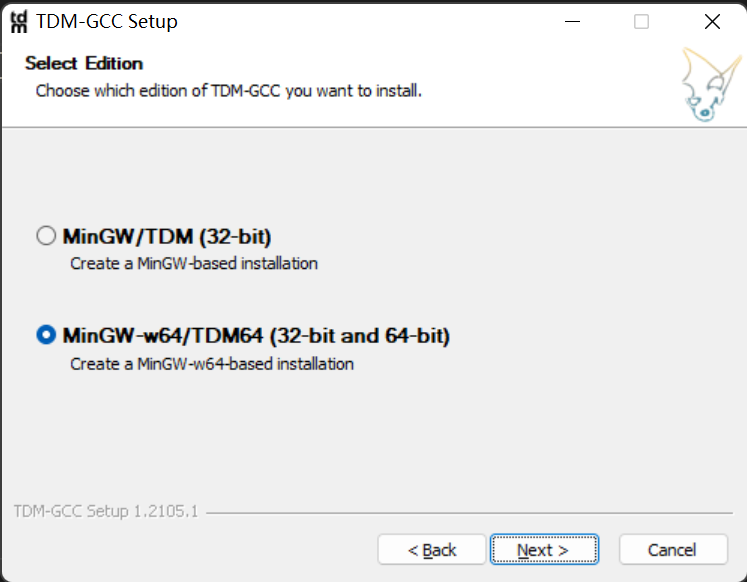
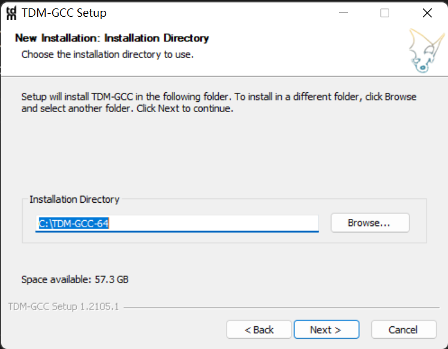
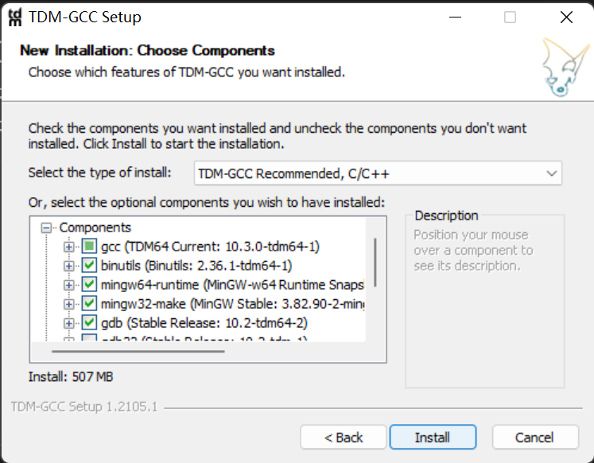
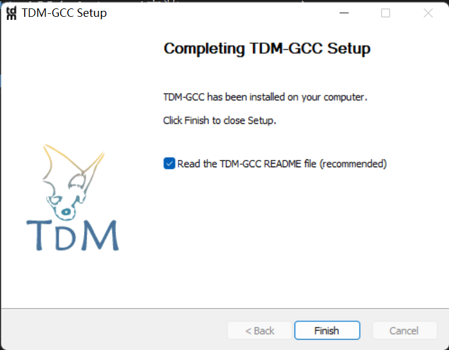
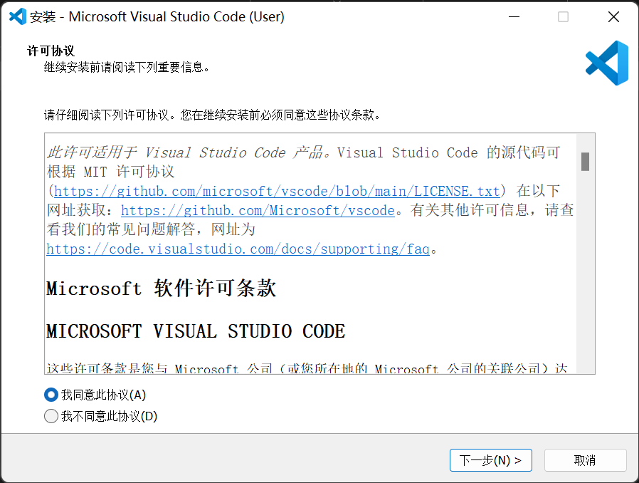
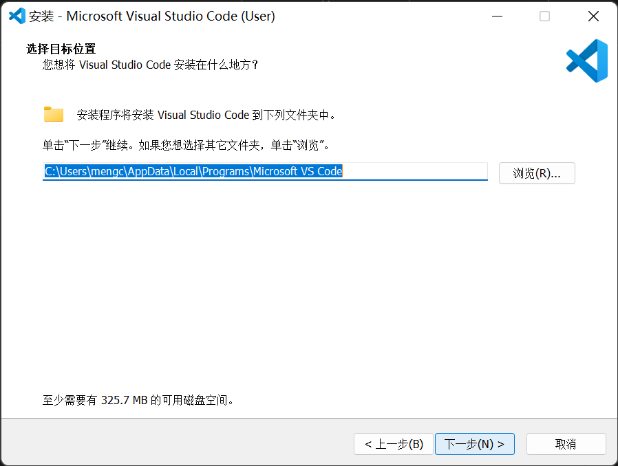
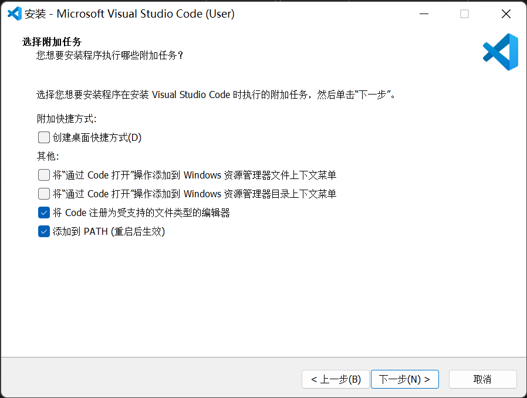
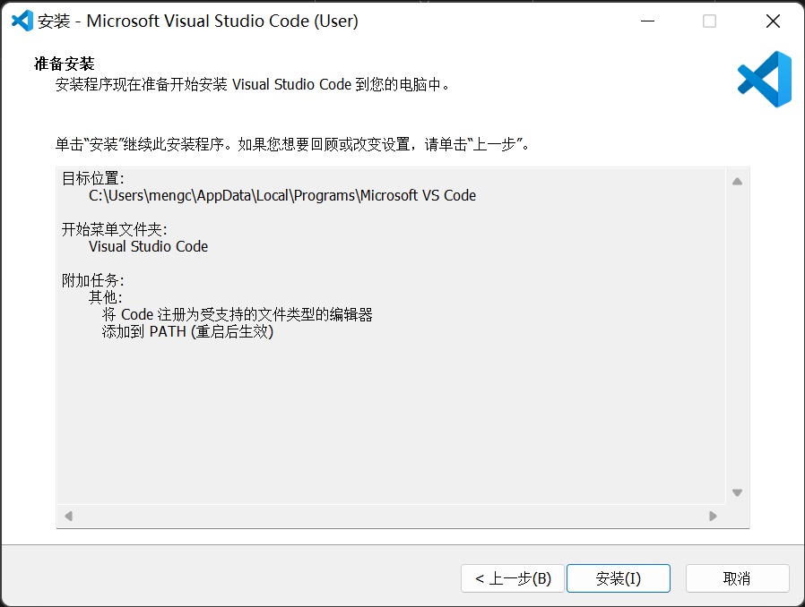

# USACO2023 课前准备
---
## 账号注册
- 注册[洛谷账号](https://www.luogu.com.cn/)（**主要练习**）
   - 加入团队[思铺教育](https://www.luogu.com.cn/team/36943)
- 注册[openjudge](http://noi.openjudge.cn/) （**前期使用**）
- 注册[官方训练账号](https://train.usaco.org/)（**考前使用**）
---
## 编程软件安装
- #### 安装 **编译器**
> 1. 下载 TDM-GCC 安装包 [点击开始下载](https://lestore.lenovo.com/detail/L101412) 
> 2. 下载完成后，双击开始安装
>     1. 点击**Create** 
>     2. 点击**Next** 
>     3. 继续**Next** 
>     4. 点击**Install** 
>     5. 最后**Finish** 
>    
- #### 安装 **编辑器**
> 1. 下载 VScode 安装包 [点击开始下载](https://lestore.lenovo.com/detail/22856)
> 2. 下载完成后，双击开始安装
>     1. 选择**我同意**，点击**下一步**  
>     2. 一路点击**下一步**    
>     3. 点击**安装**  
> 

## 笔记软件安装
   *选择思维导图软件作为笔记*
- mindmaster [点击开始下载](https://www.edrawsoft.cn/mindmaster/)
